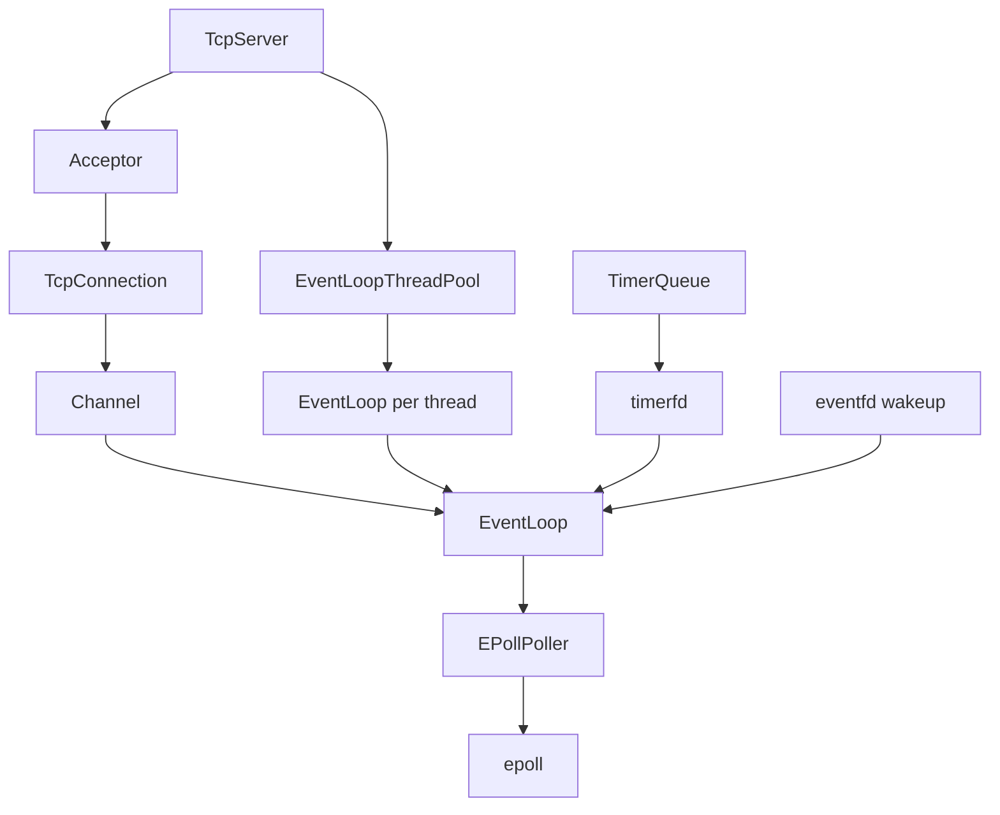

# mini_muduo

mini_muduo 是一个基于 C++11 实现的简化版 muduo 高性能网络库。项目采用 Reactor 模型、epoll IO 多路复用、非阻塞 Socket、EventLoop 事件循环、TcpServer/TcpConnection 封装、多线程 Reactor 和 TimerQueue 定时器机制，目标是用较小的代码规模还原 muduo 网络库的核心设计。

## 技术栈

- C++11
- Linux
- Socket
- epoll
- Reactor
- eventfd
- timerfd
- 多线程
- RAII
- 智能指针
- CMake

## 核心功能

- Socket 基础封装
- Channel 事件分发
- EPollPoller
- EventLoop
- Acceptor
- Buffer
- TcpConnection
- TcpServer
- EventLoopThreadPool
- TimerQueue
- EchoServer 示例
- 压测客户端
- 一键测试脚本

## 项目架构



## 目录结构

```text
.
├── CMakeLists.txt
├── README.md
├── docs
│   ├── architecture.md
│   ├── development_stages.md
│   ├── interview_notes.md
│   └── resume_description.md
├── examples
│   ├── benchmark_client.cc
│   ├── blocking_echo_server.cc
│   ├── discard_server.cc
│   ├── echo_server.cc
│   └── example_basic.cc
├── include
│   ├── base
│   │   ├── Logger.h
│   │   ├── Timestamp.h
│   │   └── nocopyable.h
│   └── net
│       ├── Acceptor.h
│       ├── Buffer.h
│       ├── Channel.h
│       ├── EPollPoller.h
│       ├── EventLoop.h
│       ├── EventLoopThread.h
│       ├── EventLoopThreadPool.h
│       ├── InetAddress.h
│       ├── Poller.h
│       ├── Socket.h
│       ├── SocketsOps.h
│       ├── TcpConnection.h
│       ├── TcpServer.h
│       ├── Timer.h
│       ├── TimerId.h
│       └── TimerQueue.h
├── scripts
│   └── run_all_tests.sh
├── src
│   ├── base
│   └── net
└── tests
```

## 编译

```bash
mkdir build
cd build
cmake ..
make -j$(nproc)
```

## 运行测试

```bash
bash scripts/run_all_tests.sh
```

## 运行 EchoServer

```bash
./build/examples/echo_server
```

使用 telnet 测试：

```bash
telnet 127.0.0.1 9001
```

## 运行压测客户端

```bash
./build/examples/benchmark_client 127.0.0.1 9001 10000
```

## 模块说明

- Logger：提供简单日志输出能力，便于观察网络库运行状态和测试过程。
- Timestamp：封装时间点，用于日志、定时器和时间相关计算。
- Socket：以 RAII 方式管理 socket fd，封装 bind、listen、accept、shutdown 等基础操作。
- Channel：封装 fd 及其关注事件，是 EventLoop 分发 IO 事件的基本单元。
- Poller：抽象 IO 多路复用接口，隔离 EventLoop 与具体 poll/epoll 实现。
- EventLoop：事件循环核心，负责 poll、事件分发、跨线程任务执行和定时任务调度。
- Acceptor：负责监听 socket，在新连接到来时 accept 并回调 TcpServer。
- Buffer：封装输入输出缓冲区，通过 readerIndex 和 writerIndex 管理可读、可写区域。
- TcpConnection：表示一条 TCP 连接，负责读写、关闭、回调触发和生命周期管理。
- TcpServer：服务器入口，管理 Acceptor、连接表和线程池，将新连接分配给 EventLoop。
- EventLoopThreadPool：实现 one loop per thread 模型，让多个 EventLoop 分布在不同线程中处理连接。
- TimerQueue：基于 timerfd 管理定时任务，并将超时事件纳入 epoll 事件循环。

## 项目亮点

- 基于 Reactor 模型组织网络事件处理流程。
- 使用 epoll 实现 Linux 下的 IO 多路复用。
- 使用 eventfd 实现跨线程唤醒，让其他线程可以安全投递任务到 EventLoop。
- 使用 timerfd 将定时任务纳入事件循环，避免额外轮询线程。
- 使用 one loop per thread 多线程模型，支持多连接并发处理。
- 使用 Buffer 提供 TCP 粘包/半包处理的基础能力。
- 使用 RAII 管理 socket fd，降低资源泄漏风险。
- 提供 EchoServer、DiscardServer、BenchmarkClient 和自动化测试脚本进行验证。

## 学习收获

这个项目覆盖了 C++ 后端网络编程中的核心能力：Linux 系统调用、非阻塞 IO、epoll 事件驱动、跨线程任务调度、TCP 连接生命周期、缓冲区设计和多线程 Reactor 模型。通过从底层 Socket 封装逐步构建到 TcpServer，可以系统理解一个高性能网络库的分层设计，也能在面试中清晰说明为什么这样设计和每一层解决什么问题。
