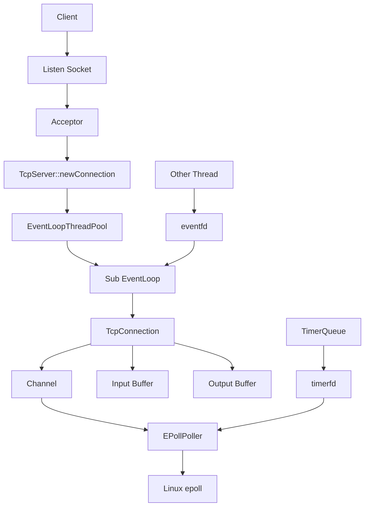

# mini_muduo 架构文档

## 1. Reactor 模型说明

Reactor 模型的核心思想是：由一个事件循环统一等待 IO 事件，当 fd 可读、可写或发生错误时，再把事件分发给对应的处理对象。本项目中 EventLoop 负责循环，EPollPoller 负责等待事件，Channel 负责保存 fd 与回调，TcpConnection 负责具体连接的读写逻辑。

这种模型避免了一个连接一个阻塞线程的方式，适合大量连接同时在线但每个连接并非一直活跃的场景。

## 2. 单 Reactor 到多 Reactor 的演进

单 Reactor 模型中，监听新连接、处理读写事件、执行回调都在同一个 EventLoop 中完成，结构简单，适合理解事件驱动流程。

多 Reactor 模型进一步引入 EventLoopThreadPool：主 EventLoop 负责监听连接，新的 TcpConnection 按轮询方式分配给子 EventLoop。每个子 EventLoop 运行在独立线程中，形成 one loop per thread，提高多连接并发处理能力。

## 3. EventLoop 的作用

EventLoop 是网络库的调度中心，主要职责包括：

- 调用 Poller 等待活跃事件。
- 遍历活跃 Channel 并执行回调。
- 通过 runInLoop 和 queueInLoop 支持跨线程任务投递。
- 使用 eventfd 唤醒正在 epoll_wait 的线程。
- 集成 TimerQueue，让定时任务和 IO 事件走同一套事件循环。

## 4. Channel 的作用

Channel 是 fd 的事件代理。它不拥有 fd，只记录 fd 关注的事件、实际发生的事件，以及 read/write/close/error 等回调。EventLoop 不直接理解 TcpConnection 的业务逻辑，而是通过 Channel 分发事件，从而解耦底层事件检测和上层连接处理。

## 5. Poller / EPollPoller 的作用

Poller 是抽象基类，定义 updateChannel、removeChannel、poll 等接口。EPollPoller 是 Linux epoll 的具体实现，负责 epoll_create、epoll_ctl、epoll_wait 等系统调用。

这样设计的好处是 EventLoop 依赖抽象 Poller，而不是直接绑定 epoll 细节；如果以后要扩展 poll 或其他平台实现，可以复用 EventLoop 的大部分逻辑。

## 6. TcpConnection 生命周期

TcpConnection 表示一条已经建立的 TCP 连接。连接创建后，TcpServer 设置连接回调、消息回调和关闭回调，然后调用 connectEstablished，使 Channel 开始关注可读事件。

连接关闭时，TcpConnection 触发 closeCallback，TcpServer 从连接表中移除该连接，并通过 connectDestroyed 关闭 Channel 事件。TcpConnection 使用 shared_ptr 管理生命周期，避免回调执行过程中对象被提前释放。

## 7. TcpServer 如何管理连接

TcpServer 持有 Acceptor 和连接表。Acceptor 监听到新连接后回调 TcpServer::newConnection，TcpServer 创建 TcpConnection，生成连接名，将其保存到 map 中，并把连接分配给某个 EventLoop。

当连接关闭时，TcpServer 根据连接名从 map 中删除对应 TcpConnection，完成资源回收。

## 8. EventLoopThreadPool 如何实现 one loop per thread

EventLoopThreadPool 内部管理多个 EventLoopThread。每个 EventLoopThread 启动一个线程，并在线程函数中创建和运行一个 EventLoop。TcpServer 可以从线程池中获取下一个 EventLoop，将连接分发过去。

one loop per thread 的关键约束是：每个 EventLoop 只在自己的线程中运行，属于该 EventLoop 的 Channel 和 TcpConnection 也主要在该线程处理。跨线程操作通过 queueInLoop 投递，保证线程边界清晰。

## 9. TimerQueue 如何通过 timerfd 接入 epoll

TimerQueue 使用 timerfd 创建一个可读 fd。当最近的定时任务到期时，timerfd 变为可读，EventLoop 通过 epoll 感知该事件，然后触发 TimerQueue 的处理逻辑。

这种方式把定时任务变成普通 fd 事件，避免额外定时线程，也让 IO 事件和超时事件都由 EventLoop 统一调度。

## 10. 核心调用流程

### 新连接流程

```text
client connect
→ Acceptor readable
→ accept
→ TcpServer::newConnection
→ TcpConnection
→ connectEstablished
→ Channel enableReading
```

### 消息读取流程

```text
socket readable
→ EPollPoller
→ Channel::handleEvent
→ TcpConnection::handleRead
→ Buffer::readFd
→ messageCallback
```

### 消息发送流程

```text
conn->send
→ sendInLoop
→ write
→ outputBuffer
→ enableWriting
→ handleWrite
```

## 11. 总体架构图


